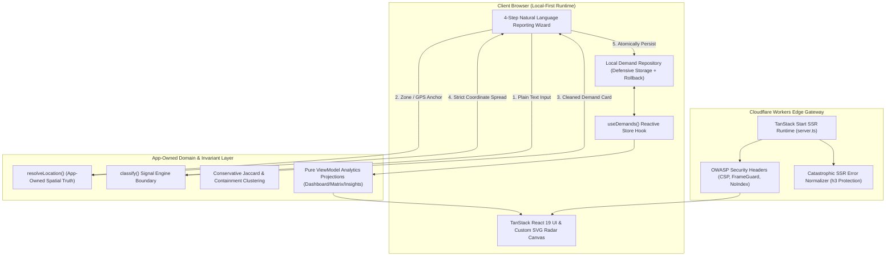

<div align="center">

# 📡 DemandRadar

### **Building the Hyperlocal Demand Graph for Emerging Cities**

_Google Maps indexes what exists. DemandRadar reveals what is missing._

[](https://workers.cloudflare.com/)
[-FF4154?style=for-the-badge&logo=react&logoColor=white>)](https://tanstack.com/start)
[](https://www.typescriptlang.org/)
[](https://tailwindcss.com/)
[-000000?style=for-the-badge&logo=bun&logoColor=white>)](https://bun.sh/)
[](#-privacy-by-design--security-hardening)

<br />

[Explore Architecture](#-system-architecture) •
[Core Thesis](#-the-story-behind-demandradar) •
[Clustering Engine](#-conservative-deterministic-clustering-engine) •
[Domain Model](#-domain-model--type-contracts) •
[Resume & Interview Guide](#-resume-impact--interview-talking-points) •
[Local Setup](#-quickstart--local-development) •
[Author & Contact](#-author--contact)

---

</div>

## 💡 The Story Behind DemandRadar

### 1. The Asymmetric Information Problem in Physical Cities

Every day in dense, fast-growing urban hubs like Bengaluru, Mumbai, and Delhi, thousands of commercial businesses and public services open in the wrong places, while hyper-concentrated citizen demands remain invisible:

- **40%+ of retail and micro-service businesses fail within year one** because location scouting relies on trailing, lagging indicators: foot-traffic surveys, broker hunches, or expensive historical credit-card datasets.
- **Meanwhile, communities suffer from critical service voids.** In Yelahanka, hundreds of students study in crowded PG rooms because there is no 24-hour quiet workspace. In Whitefield, commuters wait 45 minutes for last-mile feeder transit. In Indiranagar, women face poorly lit transit gaps after 10 PM.
- **The Tragedy of Unstructured Chatter:** Today, these unmet needs are vented in ephemeral silos—residential WhatsApp groups, Reddit threads (`r/bangalore`), and Twitter grievances. They evaporate without structure, spatial aggregation, or economic actionability.

```
Traditional GIS (Google Maps, OpenStreetMap):
[Indexes Supply]  ──>  "Where is the nearest pharmacy?"  ──>  Shows existing storefronts.

DemandRadar:
[Indexes Demand]  ──>  "Where SHOULD a pharmacy open?"   ──>  Reveals unserved demand clusters.
```

### 2. The DemandRadar Paradigm

DemandRadar bridges the gap between **community needs** and **capital/civic allocation**:

1. **Frictionless Citizen Voice:** Residents submit natural language needs in seconds without registration barriers or intrusive personal telemetry.
2. **Deterministic Signal Engine:** Raw, messy descriptions are cleansed of PII, categorized across 14 municipal and commercial verticals, classified by urgency and impact, and converted into typed, machine-readable **Demand Cards**.
3. **App-Owned Spatial Ground Truth:** Geographic coordinates and zone labels are strictly decoupled from generative models to prevent spatial hallucinations.
4. **Conservative Corroboration Engine:** Clustered signals in identical zones are evaluated with normalized token containment and Jaccard similarity to quantify market viability.
5. **Multi-Actor Actionable Routing:** Demand is routed to the exact stakeholders equipped to resolve it—Local Businesses, Civic Bodies / Municipalities, NGOs, Transit Authorities, or Neighborhood Groups.

---

## 🏗️ System Architecture

DemandRadar is built as a high-performance, edge-rendered Server-Side Rendering (SSR) application designed for zero cold-start latency, verifiable spatial invariants, and complete privacy isolation.



### Architectural Highlights & Key Invariants

| Layer                 | Implementation Pattern                | Architectural Rationale                                                                                                                                                       |
| :-------------------- | :------------------------------------ | :---------------------------------------------------------------------------------------------------------------------------------------------------------------------------- |
| **Edge SSR Runtime**  | TanStack Start on Cloudflare Workers  | Edge-first hydration, sub-50ms TTFB across regions, zero server maintenance overhead.                                                                                         |
| **Spatial Invariant** | Strict Location Ownership Boundary    | **Hard Rule:** AI models must **never** synthesize or mutate coordinates. Location is verified by app-owned resolvers (`resolveLocation()`) and spread _after_ model outputs. |
| **Clustering Core**   | Partitioned Jaccard & Containment     | Eliminates $O(N^2)$ cross-city comparisons and prevents single-link transitive false-positive merges without requiring heavy vector databases.                                |
| **Presentation**      | Pure Immutable ViewModels             | All analytical math (heat maps, leaderboards, opportunity scores) is computed in pure functional projections isolated from UI JSX rendering.                                  |
| **Data Resilience**   | Local Repository with Atomic Rollback | Defensively handles browser storage quotas, malformed payloads, canonical seed collisions, and multi-key upvote transactions.                                                 |

---

## 🔬 Core Engineering Innovations

### 1. The Location Ownership Invariant

In geo-spatial AI systems, allowing an LLM or classifier to infer or output coordinates leads to fatal spatial hallucinations (e.g., placing a Koramangala request in Whitefield, 18 km away). DemandRadar enforces a strict architectural boundary:

```typescript
// 1. AI Interface is strictly non-spatial
export interface ClassifyInput {
  raw_text: string;
  location_context?: { area_label?: string; city?: string; micro_area?: string }; // READ-ONLY CONTEXT
}

// 2. ClassifyOutput NEVER contains location fields
export interface ClassifyOutput {
  clean_text: string;
  category: DemandCategory;
  urgency: number; // 1-5
  signal_strength: number; // 0-100
  confidence_score: number;
  recommended_actor: RecommendedActor;
  suggested_action: string;
}

// 3. Location is resolved strictly by app-owned provider
const resolvedLocation = resolveLocation({ zone, locText, jitteredCoords });

// 4. SUBMISSION INVARIANT: Location spread LAST to guarantee AI cannot overwrite it
const finalReport: DemandReport = {
  ...aiClassifiedCard, // spread FIRST
  ...resolvedLocation, // spread LAST (System of Record)
  id: generateId(),
  created_at: new Date().toISOString(),
};
```

---

### 2. Conservative Deterministic Clustering Engine

Instead of relying on non-deterministic vector embeddings that hallucinate semantic links between unrelated urban issues, DemandRadar uses an app-owned, deterministic clustering engine (`buildDemandClusters.ts`):

1. **Spatial & Categorical Partitioning:** Demands are partitioned into isolated buckets keyed by `Area × Category`. Only reports sharing the same confirmed area and category can ever cluster.
2. **Text Normalization & Plural Canonicalization:**
   - Numbers and dimensions are normalized (`24x7`, `24/7` $\to$ `24 7`).
   - Stop-words (`around`, `nearby`, `please`, `service`) are stripped.
   - Domain-specific plurals (`atms` $\to$ `atm`, `pharmacies` $\to$ `pharmacy`, `tiffins` $\to$ `tiffin`) are canonicalized while protecting non-plural final-s words (`fitness`, `mess`, `bus`).
3. **Dual-Metric Similarity Threshold:**
   Two candidates $A$ and $B$ are merged into a cluster if and only if they meet strict overlap criteria:
   $$\text{Jaccard}(A, B) = \frac{|A \cap B|}{|A \cup B|} \ge 0.42 \quad \lor \quad \text{Containment}(A, B) = \frac{|A \cap B|}{\min(|A|, |B|)} \ge 0.75$$
4. **Transitive Chain Prevention:** A candidate must satisfy the similarity threshold with **every existing member** of a cluster before admission, preventing single-link drift (where $A \approx B$ and $B \approx C$ cause unrelated $A$ and $C$ to merge).
5. **Deterministic Stable IDs:** Cluster IDs are generated using a 32-bit FNV-1a hash of sorted member IDs:
   $$\text{ClusterID} = \text{demand-cluster}:[\text{category}]:[\text{area}]:\text{FNV1a}(\text{reportIds})$$

---

### 3. Hyperlocal Opportunity Scoring Algorithm

The Insights engine evaluates clustered demands to generate an **Opportunity Scorecard ($0 - 100$)** for entrepreneurs and civic administrators:

$$\text{Opportunity Score} = \min\left(100, \left\lfloor \overline{\text{SignalStrength}} \times 0.6 + \text{MemberCount} \times 8 \right\rfloor\right)$$

- **$\overline{\text{SignalStrength}}$ ($0-100$):** Average AI-evaluated urgency, text specificity, and keyword confidence across all corroborating citizen reports.
- **$\text{MemberCount}$:** Number of independent citizen reports in the cluster, rewarding multi-source validation ($+8\text{ pts}$ per corroboration).
- **Actor Assignment Matrix:** Automatically maps categories to the most capable execution partner:
  - `study_space`, `food`, `fitness`, `pharmacy`, `laundry`, `pg_hostel` $\to$ **Local Business**
  - `womens_safety` $\to$ **Government / Civic Body**
  - `mental_health`, `daycare` $\to$ **NGO**
  - `transport` $\to$ **Transport Authority**
  - `other` $\to$ **Community Group**

---

### 4. Zero-Dependency SSR-Safe Vector Radar Map

Rather than bloating the client bundle with multi-megabyte third-party map SDKs (Mapbox, Leaflet, Google Maps), DemandRadar features a custom mathematical SVG Radar Engine (`projectToCanvas`):

- **Linear Bounding Box Projection:** Maps Bengaluru geodetic coordinates ($12.80^\circ - 13.13^\circ\text{ N}$, $77.50^\circ - 77.80^\circ\text{ E}$) directly to an SVG viewport ($0 - 100\%$ relative coordinates):
  $$x = \left(\frac{\text{lng} - \text{minLng}}{\text{maxLng} - \text{minLng}}\right) \times 100, \quad y = \left(1 - \frac{\text{lat} - \text{minLat}}{\text{maxLat} - \text{minLat}}\right) \times 100$$
- **SSR-Safe:** Pre-renders identically on Cloudflare Workers and client hydration without layout shift (CLS: 0.00).
- **Dynamic CSS Radar Sweep:** Hardware-accelerated conic-gradient sweep with pulsating signal ping indicators.

---

### 5. Privacy-by-Design & Security Hardening

- **Automated PII Redaction Pipeline:** Every incoming text is scrubbed before memory allocation or persistence using high-precision regex matching Indian phone numbers (`+91`, 10-digit mobile), email addresses, and 12-digit national identity numbers.
- **Spatial Truncation & Privacy Fuzzing:** Coordinates are rounded to 3 decimal places (~110-meter precision), preventing individual household identification.
- **Anti-Stacking Centroid Jitter:** User submissions receive a deterministic pseudo-random spatial offset ($\pm 1\text{ km}$) derived from an FNV hash of the submission content, ensuring pins distribute realistically across the zone without stacking.
- **Defense-in-Depth Edge Headers:** Applied at the Cloudflare Worker boundary:
  - `Content-Security-Policy (CSP)`: Strict script-src, style-src, and frame-ancestors restrictions.
  - `X-Robots-Tag: noindex, nofollow`: Prevents search scrapers from indexing staging/pilot nodes.
  - `X-Content-Type-Options: nosniff` & `X-Frame-Options: DENY`.
- **Catastrophic SSR Error Interception:** Custom error middleware in `server.ts` intercepts edge handler throws that `h3` typically swallows into opaque 500 JSON bodies, serving a clean branded recovery page while preserving valid HTTP status codes.

---

## 🖥️ Feature Walkthrough

### 1. 4-Step Citizen Reporting Wizard (`/report`)

- **Step 1: Describe:** Natural language text area with real-time prompt suggestions.
- **Step 2: Locate:** One-click Bengaluru pilot zone selector (10 zones) + optional browser GPS lock with automatic centroid resolution.
- **Step 3: Preview:** Live real-time classification preview displaying categorized Demand Card, calculated urgency chip, signal strength meter, and proposed action.
- **Step 4: Submit:** Instant local persistence and reactive dashboard propagation.

### 2. Executive Intelligence Dashboard (`/dashboard`)

- **Macro Metric Cards:** Total Active Signals, Average Signal Strength, Dominant Need Category, and Primary Hotspot Zone.
- **Zone × Category Demand Matrix:** High-density heatmap cross-referencing 10 municipal zones against 14 service categories with proportional color-intensity scaling.
- **Area Leaderboard & Distribution Charts:** Visual representation of highest unmet need density across urban wards.

### 3. Spatial Radar Explorer (`/map`)

- Fullscreen interactive vector radar with animated 360° sweeping line.
- Clickable signal blips that open a detailed slide-out **Demand Card Drawer** displaying full report metadata, citizen narrative, affected demographic groups, and recommended actors.

### 4. Opportunity Clustering & Insights (`/insights`)

- Aggregated cluster scorecards ranking verified market gaps by commercial viability.
- Student Area Impact analysis highlighting high-density youth & education needs.
- Underserved Zone Matrix identifying wards with the highest variety of missing essentials.

---

## 📊 Domain Model & Type Contracts

```
               ┌──────────────────────┐
               │   DemandSubmission   │
               └──────────┬───────────┘
                          │
         ┌────────────────┴────────────────┐
         ▼                                 ▼
┌──────────────────┐             ┌──────────────────┐
│  ClassifyInput   │             │ ResolvedLocation │
└────────┬─────────┘             └────────┬─────────┘
         │ (AI / Mock Engine)             │ (App-Owned Provider)
         ▼                                │
┌──────────────────┐                      │
│  ClassifyOutput  │                      │
└────────┬─────────┘                      │
         │                                │
         └────────────────┬───────────────┘
                          ▼
                 ┌──────────────────┐
                 │   DemandReport   │
                 └────────┬─────────┘
                          │
          ┌───────────────┴───────────────┐
          ▼                               ▼
┌──────────────────┐            ┌──────────────────┐
│  DemandCluster   │            │   View Models    │
│ (Jaccard Match)  │            │ (Matrix/Insights)│
└──────────────────┘            └──────────────────┘
```

### Core Entity Definitions (`src/domain/demand/types.ts`)

```typescript
export type DemandCategory =
  | "study_space"
  | "food"
  | "fitness"
  | "pharmacy"
  | "pg_hostel"
  | "printing"
  | "transport"
  | "laundry"
  | "mental_health"
  | "grocery"
  | "womens_safety"
  | "daycare"
  | "atm"
  | "other";

export type AffectedGroup =
  | "students"
  | "working_women"
  | "seniors"
  | "families"
  | "commuters"
  | "tech_workers"
  | "general";

export type RecommendedActor =
  | "local_business"
  | "government"
  | "ngo"
  | "community"
  | "transport_authority";

export interface DemandReport {
  id: string;
  created_at: string;
  reporter_session: string;
  raw_text: string;
  clean_text: string;
  title: string;
  need_summary: string;
  category: DemandCategory;
  sub_category: string;
  affected_group: AffectedGroup;
  urgency: number; // 1 to 5
  signal_strength: number; // 0 to 100
  impact_priority: "low" | "medium" | "high" | "critical";
  privacy_status: "clean" | "redacted";
  confidence_score: number; // 0 to 100
  recommended_actor: RecommendedActor;
  suggested_action: string;
  area_label: string;
  location_text: string;
  latitude: number;
  longitude: number;
  status: "new" | "reviewing" | "acknowledged";
  upvotes: number;
}
```

---

## 🛠️ Technology Stack & Engineering Tools

| Area                | Technology              | Version      | Purpose & Rationale                                                                    |
| :------------------ | :---------------------- | :----------- | :------------------------------------------------------------------------------------- |
| **Framework**       | **TanStack Start**      | `^1.167`     | Type-safe SSR framework with full router integration, server functions, and streaming. |
| **Core Library**    | **React**               | `^19.2`      | Modern React with Server Component compatibility and high-performance concurrency.     |
| **Language**        | **TypeScript**          | `^5.8`       | Configured with `strict: true`, `noImplicitAny`, and comprehensive path aliasing.      |
| **Edge Platform**   | **Cloudflare Workers**  | `Wrangler 3` | Global edge distribution, 0ms cold starts, and minimal infrastructure costs.           |
| **Styling**         | **Tailwind CSS**        | `^4.2`       | Next-gen CSS engine utilizing modern `@theme` OKLCH color spaces and fluid typography. |
| **Component UI**    | **Radix UI Primitives** | Latest       | Accessible, headless primitives (Dialog, Sheet, Tabs, Slider, Tooltip).                |
| **Icons & Charts**  | **Lucide & Recharts**   | Latest       | Clean SVG visual language and interactive SVG data charts.                             |
| **Runtime & Tests** | **Bun**                 | `^1.2`       | Ultra-fast JS engine and native test runner executing full suite in <1s.               |
| **Code Quality**    | **ESLint 9 & Prettier** | Latest       | Modern flat config linting, React hooks validation, and strict formatting.             |

---

## 🧪 Comprehensive Verification & Test Suite

DemandRadar enforces strict test-driven reliability. Every domain invariant, clustering threshold, repository rollback, and security header is backed by automated tests running on `bun:test`.

```bash
$ bun test
```

```text
 113 pass
 0 fail
 286 expect() calls
Ran 113 tests across 10 files. [955.00ms]
```

### Test Coverage Highlights

- **AI Contract & Redaction (`tests/mockClassifier.test.ts`):** Verifies deterministic output hashes, immutability of inputs, and multi-pattern PII scrubbing (phone numbers, email addresses, 12-digit Aadhaar/ID numbers).
- **Clustering Thresholds (`tests/clustering/buildDemandClusters.test.ts`):** Tests tokenization, singular/plural handling (`atm`/`atms`, `pharmacy`/`pharmacies`), stop-word pruning, exclusion of cross-area merges, and prevention of transitive over-chaining.
- **Data Repository & Failure Resilience (`tests/data/localDemandRepository.test.ts`):** Verifies JSON corruption recovery, strict schema validation, canonical seed ID preservation during collisions, and atomic upvote toggle with rollback on partial write failure.
- **Analytics & Matrix Calculations (`tests/analytics/buildDashboardViewModel.test.ts`):** Verifies mathematical cell intensities for the $10 \times 14$ demand matrix, KPI aggregation, and stable tie-breaking for equal signal scores.
- **Edge Security Hardening (`tests/securityHeaders.test.ts`):** Verifies proper injection of CSP directives, `X-Frame-Options`, and `noindex` headers at the worker response gateway.

---

## ⚡ Quickstart & Local Development

### Prerequisites

- [Bun](https://bun.sh/) (v1.2+ recommended)
- Node.js (v20+ optional, for secondary tooling)

### 1. Clone & Install

```bash
git clone https://github.com/official-vanshaj-garg/demandradar.git
cd demandradar
bun install
```

### 2. Environment Configuration

Create a `.env.local` file (optional for local mock mode; mock mode runs deterministically without external keys):

```bash
cp .env.example .env.local
```

```ini
# Map Provider: 'svg' (default, zero-dep) or 'mappls'
VITE_DEMANDRADAR_MAP_PROVIDER=svg

# Optional: Mappls Static Key (only if testing commercial map tiles)
VITE_MAPPLS_STATIC_KEY=
```

### 3. Run Development Server

```bash
bun run dev
```

Open [http://localhost:3000](http://localhost:3000) in your browser.

### 4. Code Quality & Full Validation

Run the full CI-equivalent validation pipeline (Format Check + Lint + Typecheck + Production Build):

```bash
bun run validate
```

### 5. Local Cloudflare Worker Preview

To test the production edge SSR build locally inside Wrangler's worker environment:

```bash
bun run build
bunx wrangler dev --local
```

---

## 💼 Resume Impact & Interview Talking Points

### 📄 Ready-to-Use Resume Bullets

> **Full-Stack / Frontend Engineer — DemandRadar**
>
> - Architected a high-performance hyperlocal demand intelligence platform using **TanStack Start (SSR)**, **React 19**, and **TypeScript 5.8**, deployed globally on **Cloudflare Workers** edge runtime.
> - Implemented an app-owned **spatial invariant architecture** decoupling AI text classification from geographic resolution, eliminating coordinate hallucinations across 10 municipal zones.
> - Engineered a deterministic demand clustering engine utilizing **Jaccard similarity ($\ge 0.42$)** and **Token Containment ($\ge 0.75$)**, grouping unorganized citizen reports into viable commercial opportunities without expensive vector databases.
> - Formulated an **Opportunity Scoring Algorithm** weighting signal strength, urgency, and multi-source corroboration to deliver automated market viability heatmaps across 14 commercial categories.
> - Designed a zero-dependency, SSR-safe **Vector Radar Engine** in pure SVG with linear geodetic bounding-box projection, achieving $0.00$ Cumulative Layout Shift (CLS) and sub-50ms TTFB.
> - Established comprehensive test automation with **113 unit/contract tests** in `bun:test` (<1s runtime) and hardened edge security with strict OWASP CSP headers and automated regex-based PII sanitization.

---

### 🎙️ Technical Interview Cheat Sheet (Q&A)

#### Q1: "Why did you choose a deterministic classifier and local clustering over an LLM and vector database?"

> **Answer:** "For an MVP and local pilot, deterministic engines provide three massive advantages: **zero cost per inference**, **sub-millisecond execution**, and **100% reproducible testability**. More importantly, LLMs frequently hallucinate spatial coordinates or create loose semantic connections between unrelated issues. By enforcing a strict boundary—where the classifier only outputs structured categories and urgency while an app-owned algorithm computes Jaccard/Containment overlaps within identical spatial partitions—we guarantee mathematical consistency. The codebase is designed with a clean adapter (`src/lib/ai/index.ts`) so that a production model (like Gemma 4) can drop in behind a single server function without touching UI or persistence logic."

#### Q2: "How does your clustering algorithm prevent single-link transitive false positives?"

> **Answer:** "In hierarchical or single-link clustering, if report A is similar to B, and B is similar to C, A and C can be grouped together even if they share zero common words. In `buildDemandClusters.ts`, we partition strictly by confirmed `Area × Category` first. Within each partition, when a candidate evaluates an existing cluster, it must satisfy the similarity threshold ($\text{Jaccard} \ge 0.42$ or $\text{Containment} \ge 0.75$) against **every single member** of that cluster. If it fails against even one member, a new cluster is spawned. This ensures high-cohesion, trustworthy market clusters."

#### Q3: "How does your application handle edge SSR errors on Cloudflare Workers?"

> **Answer:** "TanStack Start runs on Nitro/h3. In standard configurations, uncaught exceptions inside route handlers can be swallowed by `h3` into opaque `500 {"message": "HTTPError", "unhandled": true}` JSON responses, which breaks user experience. In `src/server.ts`, we implemented a response normalization proxy that inspects outgoing SSR responses. If an unhandled h3 JSON error is detected, it consumes the captured error stack from our error-capture module and renders a styled, branded 500 error page while maintaining standard HTTP status codes and injecting our defense-in-depth CSP headers."

#### Q4: "How did you guarantee citizen privacy without requiring authenticated accounts?"

> **Answer:** "We adopted a strict **Zero-PII Invariant**. First, we eliminate authentication friction: users interact via an opaque browser session ID. Second, prior to persistence, our sanitization pipeline runs multi-pattern regex redaction targeting Indian mobile numbers, email addresses, and national ID formats. Third, coordinates are truncated to 3 decimal places (~110 meters) and pseudo-randomly jittered within 1 km using an FNV hash of the text content. This allows pin distribution across the ward without ever exposing the user's exact residential coordinates."

---

## 🗺️ Future Roadmap

- [ ] **Layer 4: Distributed Cloud Persistence**
  - Migrate local-first storage to PostgreSQL + PostGIS with Supabase / Cloudflare D1.
  - Implement Row-Level Security (RLS) policies for anonymous multi-tenant ingestion.
- [ ] **Layer 5: Production LLM Signal Engine**
  - Drop in Google Gemma 4 / Gemini via TanStack Start `createServerFn` with strict Zod output validation.
  - Retain defensive spatial key stripping to preserve the Location Ownership Invariant.
- [ ] **Layer 6: Vector-Enhanced Semantic Deduplication**
  - Introduce `pgvector` embeddings to identify multilingual demand convergence (e.g., matching Kannada and English descriptions of the same local transit gap).
- [ ] **Layer 7: B2B Market Intelligence Portal**
  - Dedicated authenticated portal for retail franchises, dark-store operators, and healthcare providers to bid on or subscribe to verified ward-level demand clusters.

---

## 👤 Author & Contact

**Vanshaj Garg**

- **Email:** [official.vanshaj.garg@gmail.com](mailto:official.vanshaj.garg@gmail.com)
- **GitHub:** [@official-vanshaj-garg](https://github.com/official-vanshaj-garg)
- **Repository:** [https://github.com/official-vanshaj-garg/demandradar](https://github.com/official-vanshaj-garg/demandradar)

---

<div align="center">

**Built with pride by [Vanshaj Garg](mailto:official.vanshaj.garg@gmail.com) • Crafted with precision for Bengaluru • Built for Hyperlocal India**

[Back to Top ↑](#-demandradar)

</div>
